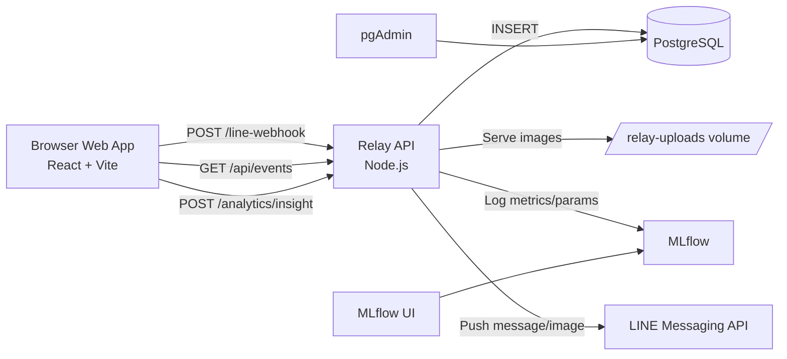

# FallGuard AI

FallGuard AI คือระบบเฝ้าระวังการล้มแบบ real-time ผ่านเว็บกล้อง (browser) และส่งแจ้งเตือนไป LINE โดยเก็บประวัติเหตุการณ์ลง PostgreSQL และเก็บ telemetry/experiment ลง MLflow

เอกสารติดตั้งแบบลงมือทำทีละขั้น:
- [SETUP_GUIDE.md](SETUP_GUIDE.md)

## Project Goals

- ตรวจจับเหตุการณ์ล้มจากหน้าเว็บ
- แจ้งเตือน LINE ได้ทั้งข้อความและรูปภาพ
- เก็บข้อมูลเหตุการณ์ย้อนหลังเพื่อดูบน timeline/calendar
- มีฐานข้อมูลและหน้า admin สำหรับตรวจสอบย้อนหลัง
- มี MLflow สำหรับติดตาม run/metrics ของการแจ้งเตือน

## System Architecture



## Main Components

- `frontend/`:
  UI ตรวจจับ + settings + timeline/calendar
- `backend/api/`:
  Relay API (`/line-webhook`, `/api/events`, `/analytics/insight`, `/health`, `/images/*`)
- `backend/database/`:
  schema + migration + connection
- `ai_service/`:
  MLflow container
- `docker-compose.yml`:
  stack หลัก (web, relay, postgres, pgadmin, mlflow)
- `docker/pgadmin/servers.json`:
  ค่า preload server ให้ pgAdmin

## Tech Stack

- Frontend: React 19, TypeScript, Vite
- Backend Relay: Node.js (HTTP server), `pg`
- Database: PostgreSQL 16
- DB GUI: pgAdmin 4
- Experiment Tracking: MLflow
- Deployment: Docker Compose (Local/Cloud VM)
- Reverse proxy/HTTPS (Cloud): Caddy (optional)

## Ports (Default)

- Web: `5173`
- Relay: `8787`
- MLflow: `5001`
- PostgreSQL: `5432`
- pgAdmin: `5050`

## Data Flow (Runtime)

1. Browser ตรวจจับการล้ม แล้วส่ง event ไป `POST /line-webhook`
2. Relay ส่ง LINE push (text + image ถ้ามี)
3. Relay บันทึกลง `event_records`, `event_images`, `alert_deliveries`
4. Relay เขียน metrics/params/tags ไป MLflow
5. Browser ดึงประวัติจาก `GET /api/events` เพื่อแสดง timeline/calendar

## Quick Start (Docker, 10-15 นาที)

1. Clone และตั้งค่า env

```bash
git clone https://github.com/ItsTM47/fallguard-ai.git
cd fallguard-ai
cp .env.relay.example .env.local
```

2. แก้ `.env.local` อย่างน้อย

```env
LINE_CHANNEL_ACCESS_TOKEN=YOUR_LINE_CHANNEL_ACCESS_TOKEN
LINE_TARGET_USER_ID=Uxxxxxxxxxxxxxxxxxxxxxxxxxxxxxxxx
DATABASE_ENABLED=true
```

3. เปิดระบบ

```bash
docker compose up --build -d
```

4. เช็กว่าบริการขึ้นครบ

```bash
docker compose ps
curl -s http://localhost:8787/health
```

5. เปิดหน้าใช้งาน

- Web: `http://localhost:5173`
- pgAdmin: `http://localhost:5050`
- MLflow: `http://localhost:5001`

ถ้าต้องการขั้นตอนละเอียดแบบพาทำจริง ไปที่ [SETUP_GUIDE.md](SETUP_GUIDE.md)

## Where Data Is Stored

### PostgreSQL (`fallguard`)

- `event_records`: เหตุการณ์หลัก (เวลาที่เกิด, confidence, metadata, status LINE)
- `event_images`: ข้อมูลไฟล์รูปที่ผูกกับ event
- `alert_deliveries`: ผลลัพธ์การส่งแจ้งเตือนต่อครั้ง
- `event_records_latest` (view): มุมมองเรียงล่าสุดด้วย `occurred_at DESC, created_at DESC`

### MLflow

- เก็บ run ต่อ event แจ้งเตือน
- ตัวอย่าง metrics:
  - `line_push_success`
  - `has_image`
  - `line_image_message`
- ตัวอย่าง params/tags:
  - `event_type`, `line_status_code`, `public_base_host`
  - `target_user`, `source=fallguard-relay`

## LINE Integration Notes

- โหมดที่แนะนำสำหรับ deploy/cloud คือใช้ `Webhook` ผ่าน relay (`/line-webhook`)
- ไม่ควรยิง LINE Messaging API ตรงจาก browser เพราะ CORS และความปลอดภัยของ token
- ถ้าต้องการส่งรูปผ่าน LINE ได้ ต้องตั้ง `LINE_PUBLIC_BASE_URL` เป็น URL `https` ที่เปิดรูปได้จริงจากภายนอก

## Common Commands

```bash
# Start/Stop stack
docker compose up --build -d
docker compose down

# Logs
docker compose logs -f --tail=200

# Migrate DB
npm run db:migrate
# หรือ
docker compose exec relay node backend/database/migrate.mjs

# Check latest events from relay
curl -s "http://localhost:8787/api/events?limit=5"

# Check MLflow API
curl -s -X POST http://localhost:5001/api/2.0/mlflow/runs/search \
  -H 'Content-Type: application/json' \
  --data '{"experiment_ids":["1"],"max_results":5}'
```

## Troubleshooting (สั้น)

- LINE ส่งไม่ออก: ตรวจ `LINE_CHANNEL_ACCESS_TOKEN`, `LINE_TARGET_USER_ID`
- รูปไม่ขึ้นใน LINE: ตรวจ `LINE_PUBLIC_BASE_URL` และ `GET /images/<file>` ต้องได้ 200
- pgAdmin ดูเหมือนไม่มีข้อมูลใหม่: อย่า `ORDER BY id`; ใช้ `event_records_latest`
- MLflow 403 Invalid Host header: ปรับ `MLFLOW_ALLOWED_HOSTS` / `MLFLOW_CORS_ALLOWED_ORIGINS`
- Build ล้มเพราะดิสก์เต็ม: prune image/cache และ build เฉพาะ service ที่ต้องใช้

## Security Checklist

- ห้าม commit `.env.local`
- เก็บ token/keys ใน env เท่านั้น
- production ควรตั้ง allowed hosts/cors แบบจำกัดโดเมนจริง
- เปิดพอร์ตสาธารณะเฉพาะจำเป็น

## Documentation

- คู่มือติดตั้งแบบเต็ม: [SETUP_GUIDE.md](SETUP_GUIDE.md)
- โครงสร้างฐานข้อมูล: [backend/database/README.md](backend/database/README.md)
